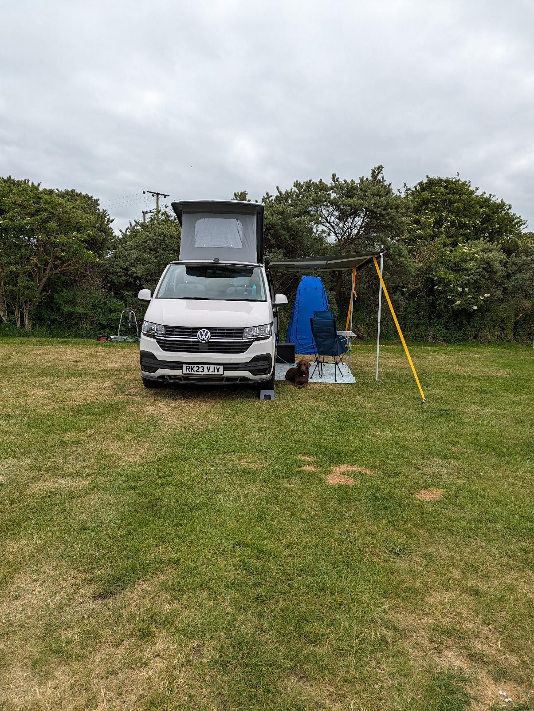
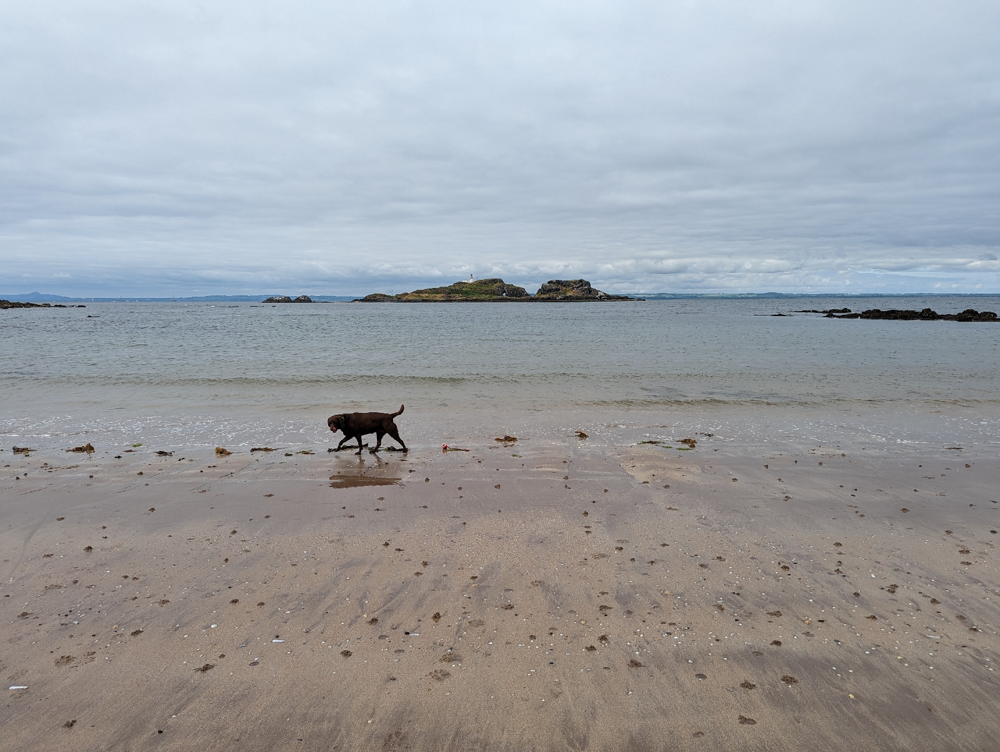
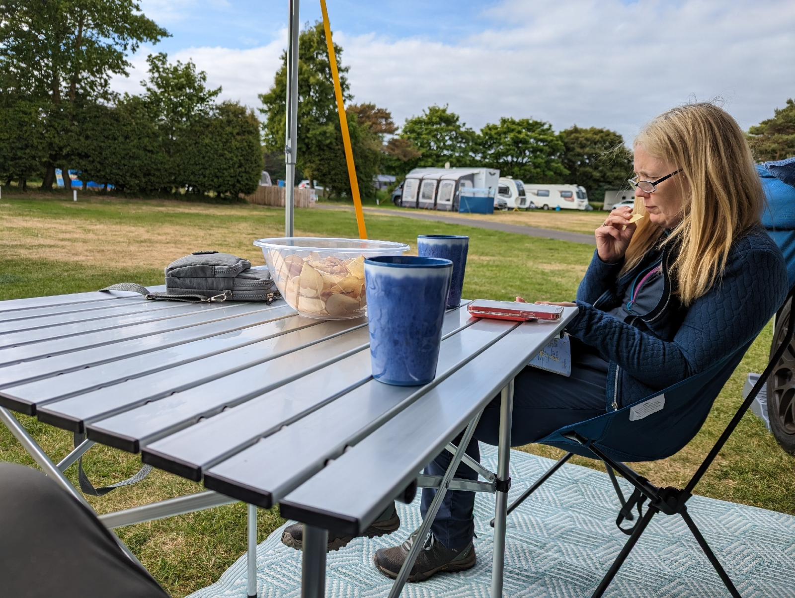
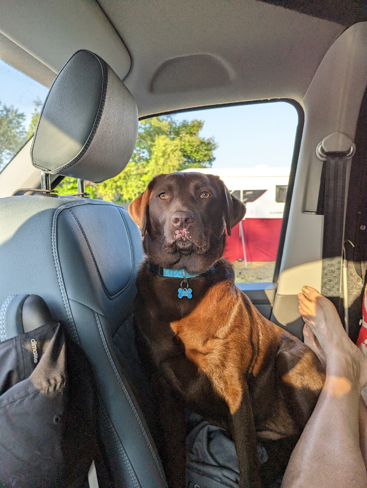
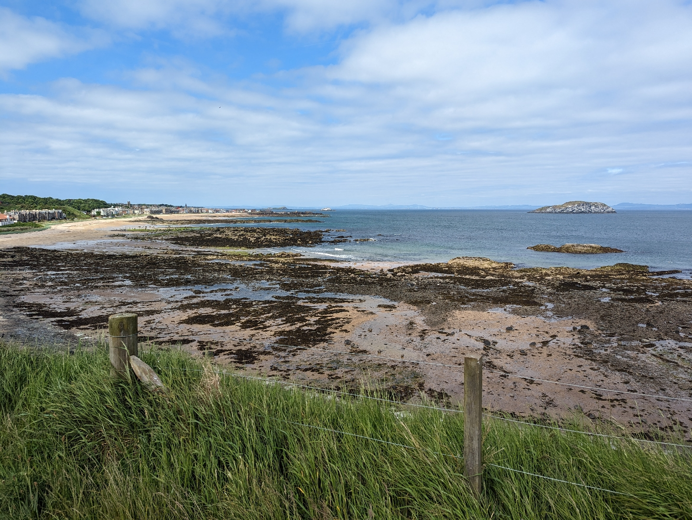

8th-11th June 2023

Just north of North Berwick, about 4km by paths into the centre. Down by the beach car park.

Good sized site but laid out in small sections. Shower block very tidy and reception sells Ice cream!!

There is a dog park by the entry in and a selection of balls for the dogs. Even a herb bed that you can take from.

Nearest bar/restaurant about 2.5 km at Dirilton along the John Muir Way. Eat there on Friday night, very good.

Gave and Becky came down Saturday afternoon and tired the dig out on the beach.

Yellowcraig Caravan and Motorhome Club Campsite

01620 850217

https://maps.app.goo.gl/BzFMTPQZDy8LyrFKA
