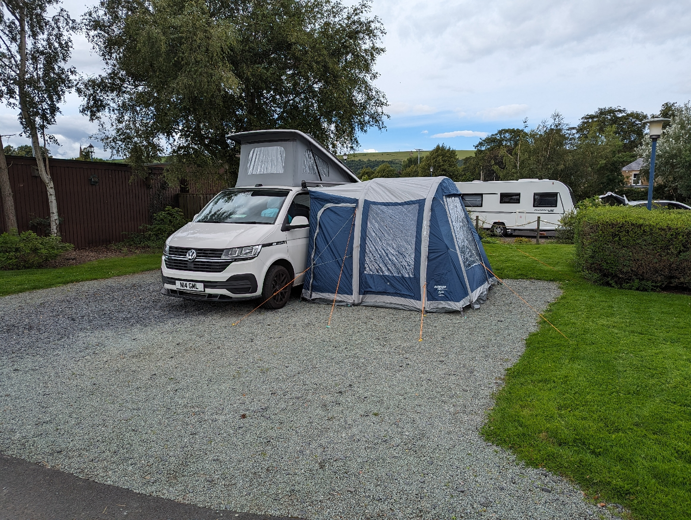
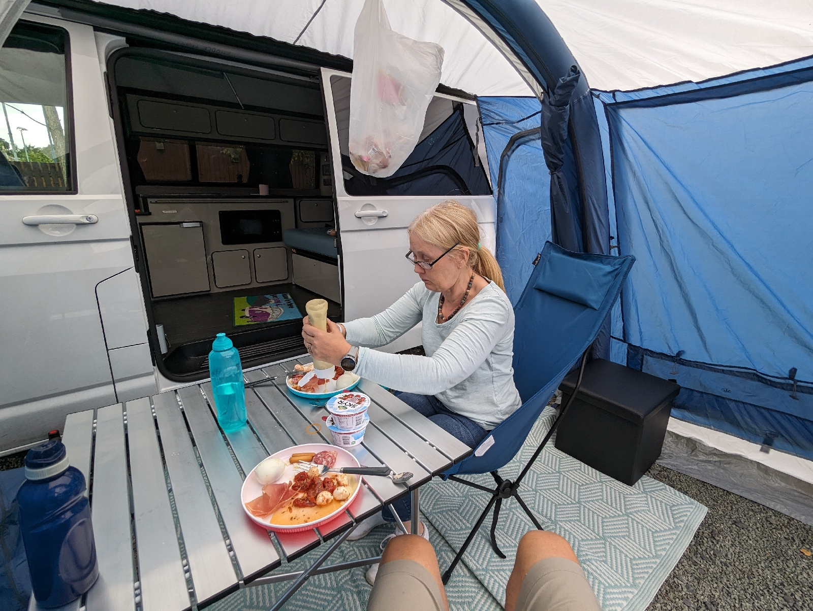

7th-9th August 2023

Melrose Gibson Campsite

First stop on a week away in the borders with the bines and no dog. Cleo at home with Gavin and Becky for the week.

Got our own awning for this trip, really good extra space

Day started with an 8km run and Denise went for a walk by the river. Then 45km loop via Dryburgh and Selkirk. A bit hilly in places and the path by the river had was hike a bike.

Melrose Gibson Site

https://maps.google.com/?cid=5738316844443429398&entry=gps

