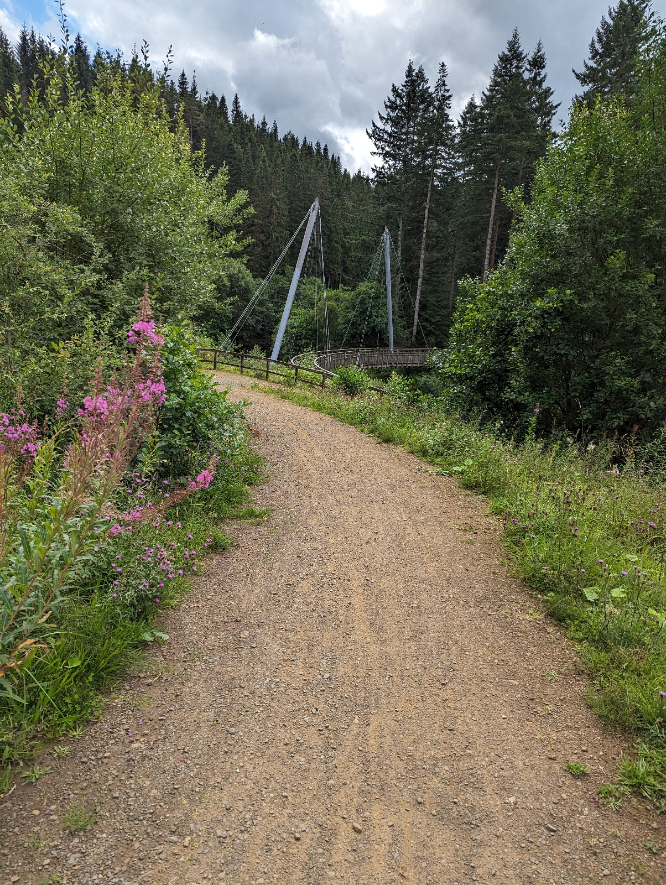

Community run campsite with lots of tent space and about 20 EHU hook ups for vans.

Small pub The Anglers Arm recently taken over nearby. In need of some TLC but pub food was good, just look beyond the damp walls with wall.paper falling off in hallway.

Cycled round Kielder Water, 28 miles of no traffic gravel, Friday the weather was wet and windy so drive up to Jedburgh (in Scotland it was sunny). Visited Mary Queen of Scots house very interesting and the Abbey in the town as well.

First attempt at using the drive away party off the awning, took under 10 mins to get positioned and reconnected.

Kielder Campsite

https://maps.app.goo.gl/r4VNDA9NisTLpYVAA

