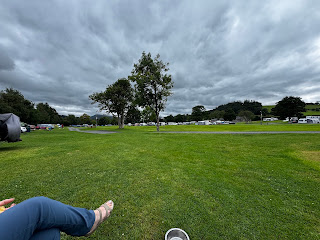

22nd-24th July 2025

Two nights at the side of Lake Bala.

Cleo a bit spooked as there have been several very low flying planes (looked like replica WWII), hopefully she will settle. Not the best place to walk her from as mostly a path alongside what can be a busy road.

<https://maps.app.goo.gl/83y1f8mvVaiRhLKU9?g_st=ipc>
